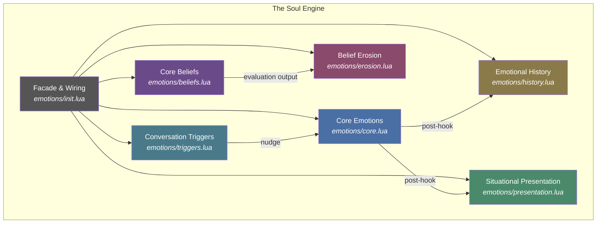
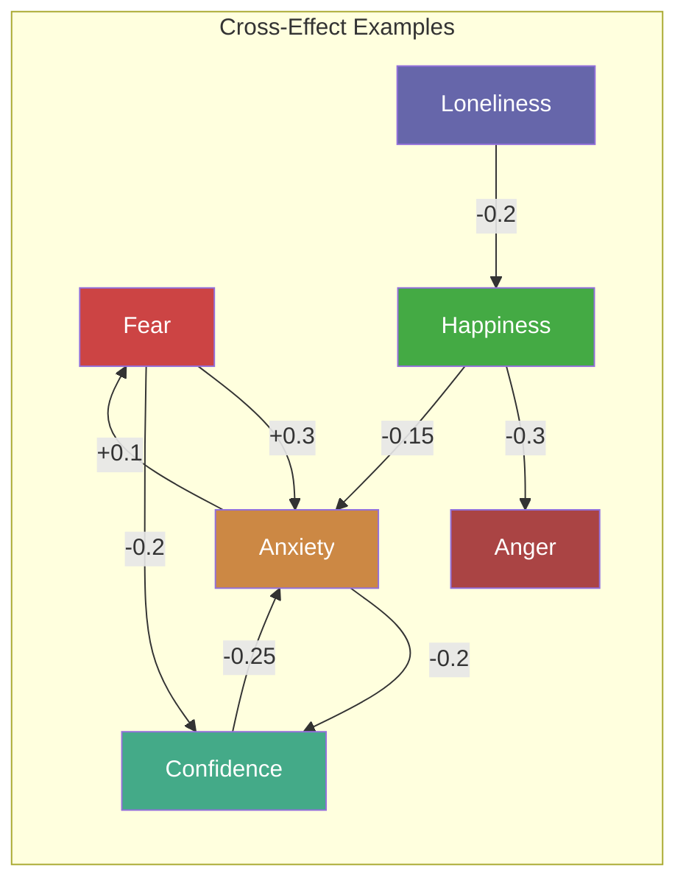
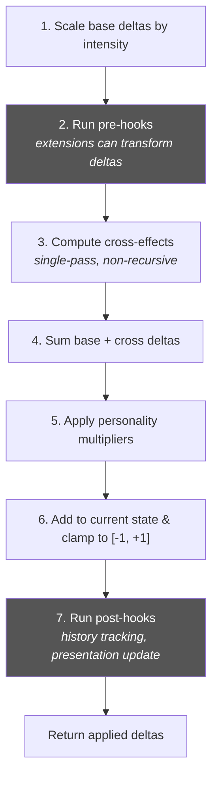
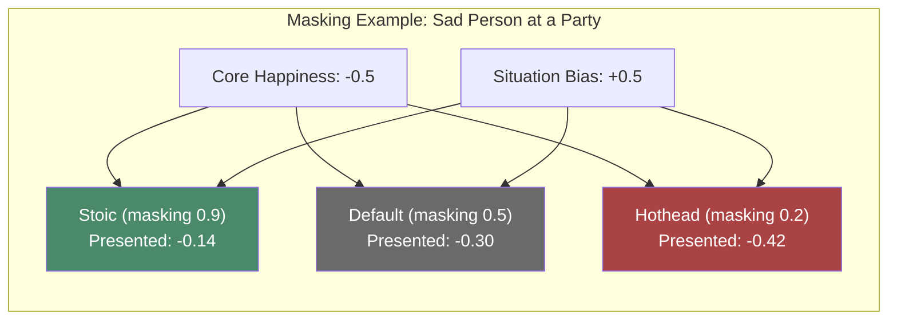
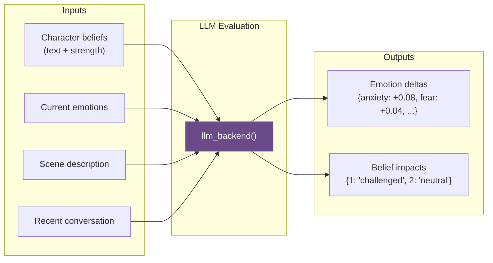
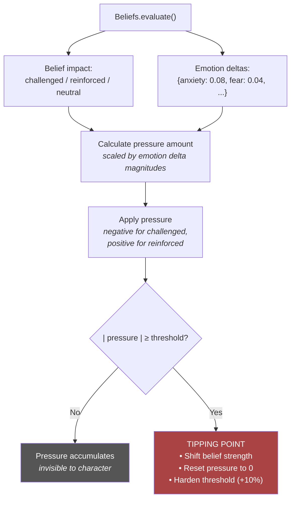
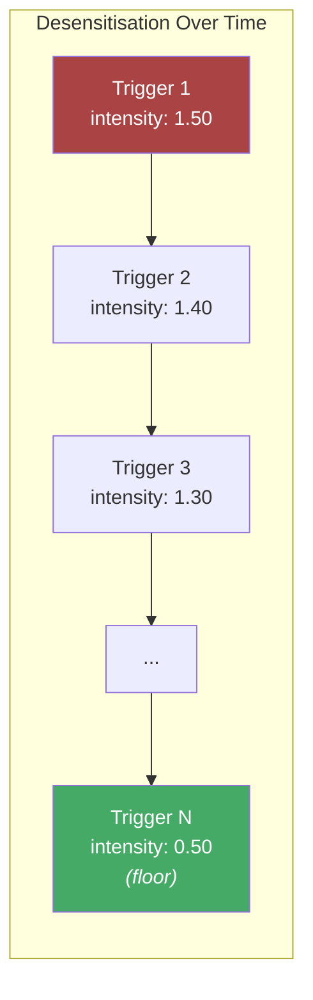
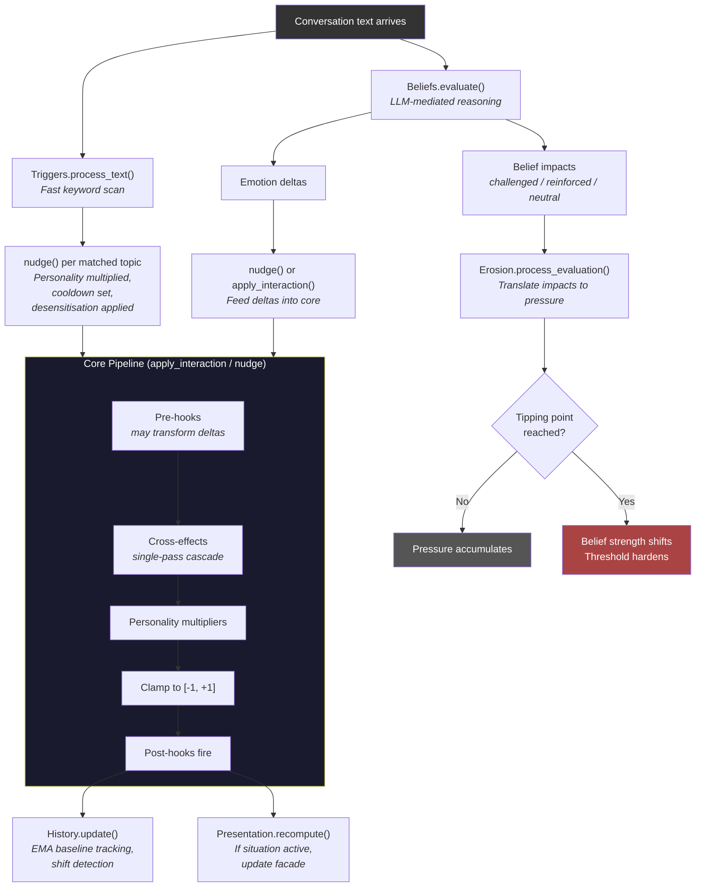
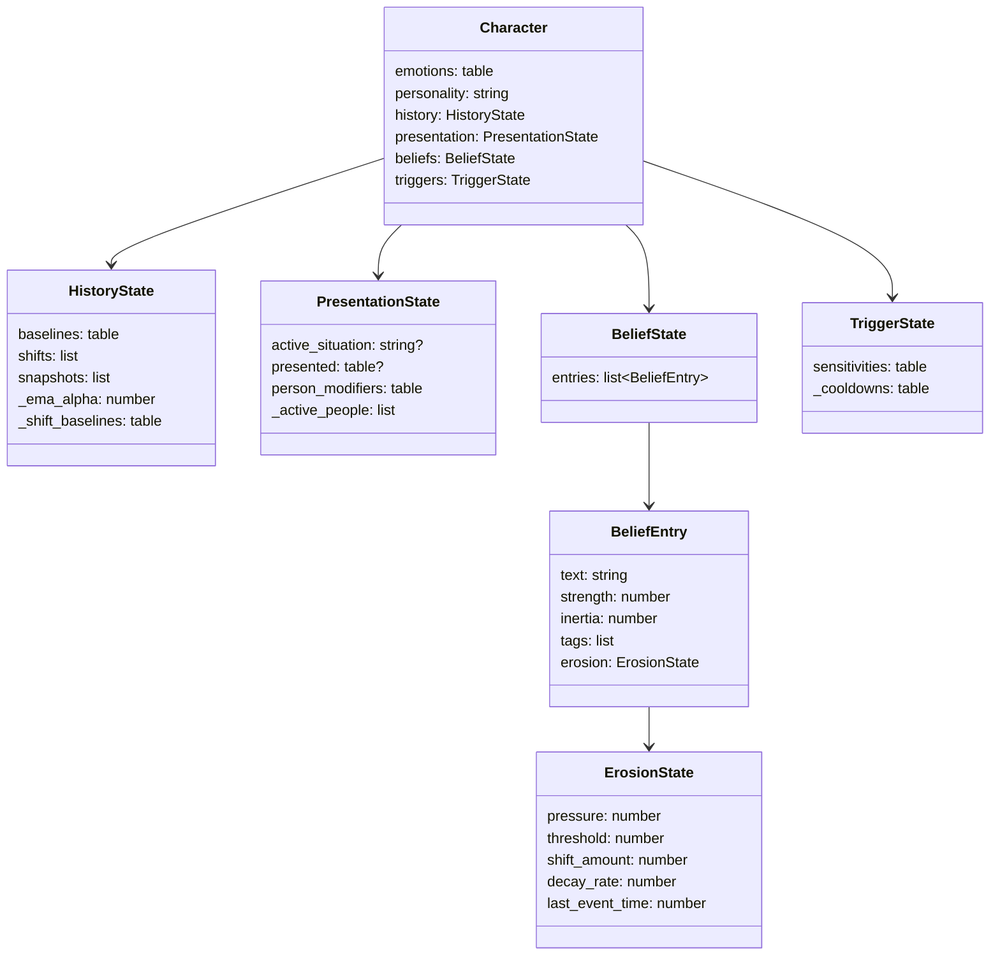

# The Soul Engine

## A Layered Emotion and Belief System for NPCs

The Soul Engine is a data layer that models the inner life of non-player characters. It tracks what an NPC feels, what they believe, what they show to the world, and how all of these evolve over time. The system does not generate dialogue or animation directly — it produces rich, queryable state that an LLM or game system can consume to make characters behave like people.

The core question the engine answers: *Given everything that has happened to this character, what are they feeling, what do they believe, and what are they hiding?*

---

## Design Principles

### 1. Emotions Are Not Booleans

Human emotions exist on a continuous spectrum and interact with each other in complex ways. A person who becomes frightened also tends to become less confident. Someone experiencing loneliness will find their happiness quietly eroded. The engine models this through a **cross-effects matrix** — when one emotion shifts, others shift sympathetically. This happens in a single pass (no feedback loops), which keeps behavior predictable while still producing emergent-feeling dynamics.

### 2. Personality Is a Lens, Not a Label

Two characters can experience the same event and react completely differently. A stoic barely flinches at a threat; a worrier spirals. Personality in the engine is implemented as a set of **per-emotion multipliers** — simple scaling factors that amplify or dampen how much each interaction affects each emotion. This is deliberately minimal. Personality doesn't change the *kind* of response, only the *magnitude*. A stoic still feels fear; they just feel less of it.

### 3. What You See Is Not What They Feel

People perform emotions. A grieving person smiles at a party. A terrified candidate projects confidence in a job interview. The engine separates **core emotions** (the truth) from **presented emotions** (the facade). The gap between them — the *masking strain* — is itself a useful signal. An NPC under high strain might stutter, avoid eye contact, or let the mask slip. The strain value gives an LLM something concrete to work with.

### 4. Beliefs Are Text, Not Code

Rather than encoding beliefs as lookup tables of condition-response pairs, beliefs are stored as **natural language text** with numerical metadata (strength, inertia). A belief like *"Violence is never the answer"* is evaluated against scene context by an LLM, which determines whether the situation challenges or reinforces it. This means the system can handle nuanced scenarios that a designer never explicitly coded — a pacifist watching their friend get attacked is qualitatively different from a pacifist watching strangers fight, and an LLM can reason about that difference.

### 5. Change Is Gradual Until It Isn't

Real belief change doesn't happen in one dramatic moment (usually). It happens through accumulated pressure — dozens of small contradictions that build up invisibly until a tipping point is reached. The engine's **erosion system** models this explicitly. Pressure accumulates below the surface, decays over time if not reinforced, and eventually crosses a threshold that shifts the belief. The threshold then increases — a belief that has been tested and survived becomes harder to shake next time.

### 6. Every Layer Feeds the Prompt

Everything the engine computes — emotional baselines, narrative shifts, masking strain, belief strengths, tipping proximity, sensitive topics — exists to be included in an LLM prompt. The system is designed to answer questions like:

- *"What emotions should colour this dialogue?"* → `get_perceived()`, `get_masking_strain()`
- *"Has this character changed over the story?"* → `get_narrative_shifts()`
- *"What topics should the NPC react strongly to?"* → `get_sensitive_topics()`
- *"Is this character close to a belief crisis?"* → `get_tipping_proximity()`

---

## Architecture Overview

The engine is composed of six modules, each responsible for one aspect of a character's inner life.



---

## The Emotion Core

**File:** `emotions/core.lua`

At the foundation are eight emotions, each a floating-point value clamped to [-1, +1]:

| Emotion | What it represents |
|---|---|
| **happiness** | Contentment, joy, positive outlook |
| **anger** | Hostility, frustration, aggression |
| **fear** | Dread, sense of danger |
| **trust** | Willingness to rely on others |
| **energy** | Vitality, motivation, stamina |
| **loneliness** | Isolation, disconnection |
| **anxiety** | Nervousness, unease, stress |
| **confidence** | Self-assurance, boldness |

### Interactions

The primary way emotions change is through **interactions** — named events that carry a set of base emotion deltas. Six interaction types are defined:

| Interaction | Primary effects |
|---|---|
| `social` | +happiness, -loneliness, +trust |
| `conflict` | +anger, +fear, -trust, +anxiety |
| `achievement` | +happiness, +confidence, -anxiety |
| `loss` | -happiness, +loneliness, -confidence, +anxiety |
| `rest` | +energy, -anger, -anxiety |
| `threat` | +fear, +anger, -trust, +anxiety |

Each emotion delta can be scaled by an **intensity** parameter. A casual disagreement (`conflict` at intensity 0.3) differs meaningfully from a life-threatening fight (`conflict` at intensity 2.0).

### Cross-Effects

Emotions don't exist in isolation. When one emotion changes, others change sympathetically. This is modelled as a sparse matrix of multipliers, applied in a **single pass** to prevent runaway feedback loops.



The single-pass constraint is important. If fear increases anxiety and anxiety increases fear, an unchecked loop would spiral both to their limits. By computing all cross-effects from the *original* deltas (not from the results of other cross-effects), the system stays stable and predictable.

### Personality Multipliers

Each personality profile defines per-emotion scaling factors. Any emotion not listed defaults to 1.0.

| Personality | Amplified | Dampened |
|---|---|---|
| **worrier** | fear (×1.5), anxiety (×1.6) | anger (×0.7), trust (×0.6), confidence (×0.5) |
| **hothead** | anger (×1.8), happiness (×1.2), confidence (×1.3) | fear (×0.5) |
| **stoic** | — | happiness (×0.5), anger (×0.4), fear (×0.4), anxiety (×0.4) |
| **social** | loneliness (×1.6), trust (×1.3), happiness (×1.2) | — |

### The Processing Pipeline

When `apply_interaction()` is called, the following steps execute in order:



### The Hook Mechanism

The core engine exposes **pre-hooks** and **post-hooks** so extension modules can participate in the pipeline without modifying core logic.

**Pre-hooks** receive the base deltas before cross-effects and can *transform* them. This is how, for example, a belief system could dampen fear deltas for a character who believes they're invincible.

**Post-hooks** receive the final applied deltas after clamping, for observation and side-effects. History tracking and presentation recomputation are wired as post-hooks.

The hook registration order in `emotions/init.lua` determines execution order:
1. History post-hook (track baselines before any other side-effects)
2. Presentation post-hook (recompute facade after final state is known)

### The Nudge Function

Not all emotional changes come from interactions. Sometimes a game event needs to directly adjust a single emotion — a jump-scare increases fear, a compliment boosts confidence. `nudge()` applies a single emotion delta with personality multipliers but without cross-effects. It's the surgical tool where `apply_interaction()` is the broad one. The triggers layer uses `nudge()` internally.

---

## Emotional History

**File:** `emotions/history.lua`

Characters have pasts. A soldier who was once consumed by fear but overcame it is a fundamentally different character than one who was never afraid. The history module tracks these arcs.

### Baselines via Exponential Moving Average

Rather than storing every emotion value at every moment, the system maintains a **baseline** per emotion — a smoothed average that represents the character's "normal" state. This is computed via EMA (Exponential Moving Average):

```
baseline = α × current + (1 - α) × previous_baseline
```

With a small alpha (default 0.05), the baseline barely reacts to short spikes. A momentary scare doesn't shift the fear baseline. But sustained fear over dozens of interactions will slowly, visibly move it — just as in real life, where a single bad day doesn't change your personality but months of stress might.

### Shift Detection

When the baseline for an emotion moves more than 0.3 from its last recorded reference point, a **shift** is recorded:

```lua
{ timestamp = 1500, emotion = "fear", from = 0.7, to = 0.1, cause = "overcame_heights" }
```

These shifts form a character's emotional biography. An LLM can be prompted with: *"This character's fear baseline shifted from 0.7 to 0.1 after 'overcame_heights'. They used to be deeply afraid but have grown past it."*

The 0.3 threshold and the reference-point reset ensure that only *significant, sustained* changes are recorded. A character who gradually becomes happier will record one or two shifts, not a continuous stream.

### Snapshots

For designer-driven story beats, explicit **snapshots** can be saved at any point:

```lua
History.take_snapshot(npc, timestamp, "after_betrayal")
```

These capture the complete emotional state at a moment in time, labelled for later reference. They're useful for before/after comparisons at narrative checkpoints.

---

## Situational Presentation

**File:** `emotions/presentation.lua`

The presentation layer answers: *"What does this character appear to feel?"*

### The Masking Formula

When a character enters a situation, each affected emotion gets a **bias** (what the situation pushes toward) and a **strength** (how strongly it pushes). Combined with the character's personality-based **masking ability**, the presented emotion is computed as:

```
presented = core + (bias - core) × strength × masking_ability
```

This is a weighted interpolation toward the bias. When `strength × masking_ability = 1`, the character perfectly masks their true emotion and presents the bias value. When the product is 0, their true emotion shows through entirely.



A stoic character at a loud party can maintain a convincing smile even when deeply unhappy. A hothead's misery shows through despite the festive atmosphere. The default character lands somewhere in between.

### Masking Strain

The **strain** metric (0 to 1) measures how hard the character is working to maintain their facade. It's computed as the average absolute gap between core and presented emotions, normalized so that an average gap of 0.5 corresponds to strain 1.0.

Strain is a powerful signal for an LLM. High strain suggests the character might:
- Use shorter, more clipped sentences
- Avoid eye contact
- Respond with slightly inappropriate timing
- Eventually snap or let the mask slip

### Person Modifiers

Certain people can modify a character's facade. A character who is normally calm might show more anxiety when their father is present:

```lua
char.presentation.person_modifiers["npc_father"] = {
    anxiety = { bias = 0.3, strength = 0.4 }
}
```

When `enter_situation()` is called with a people list, person modifiers stack on top of situation modifiers (biases add, strengths take the maximum). This models the common human experience of being more or less composed depending on who's in the room.

### Computed, Not Stored

Presented emotions are **recomputed** whenever core emotions change (via post-hook) or when the situation changes. They are never persisted. This ensures consistency — there is one source of truth (core emotions), and the presentation is always a deterministic function of that truth plus the current situation.

---

## Core Beliefs

**File:** `emotions/beliefs.lua`

Beliefs represent what a character holds to be true about the world. Unlike emotions, which are reactive and momentary, beliefs are stable structures that colour how a character interprets events.

### The Text-First Approach

Each belief is stored as natural language:

```lua
{
    text = "Violence is never the answer. There is always a peaceful solution.",
    strength = 0.8,       -- how strongly held (0..1)
    inertia = 0.7,        -- resistance to change (0..1)
    tags = {"pacifism", "conflict"},
}
```

The `text` field is the belief's identity. It's what gets included in LLM prompts and what the LLM reasons about. The `strength` and `inertia` are numerical handles for the erosion system. The `tags` enable quick filtering and, in the fake LLM, keyword-based evaluation.

### LLM Evaluation

The central function `Beliefs.evaluate()` takes a character's beliefs, the current scene, and recent conversation, and returns:
1. **Emotion deltas** — how the character's emotions should shift based on belief/context interaction
2. **Belief impacts** — whether each belief was "challenged", "reinforced", or unaffected ("neutral")



### The Pluggable Backend

The LLM backend is a simple function slot:

```lua
Beliefs.set_llm_backend(function(beliefs, emotions, scene, conversation)
    -- Call your LLM here
    return emotion_deltas, belief_impacts
end)
```

The default backend is a **keyword heuristic** — it scans the scene and conversation for words that align with or contradict belief tags. "Violence" in the context challenges a "pacifism"-tagged belief; "peace" reinforces it. This is intentionally crude. It exists to make the pipeline testable without an LLM dependency. The expectation is that a real LLM will be swapped in for production use.

The fake backend's logic:
- Match belief tags against curated keyword lists (challenge keywords like "fight", "betray"; reinforce keywords like "peace", "loyal")
- When challenged: increase anxiety, fear, and anger proportional to belief strength; decrease happiness
- When reinforced: increase happiness and confidence; decrease anxiety
- When neutral: no emotion changes

### The Shock Mechanism

For scripted story events — a dramatic betrayal, a revelation — the designer can bypass the LLM and directly modify a belief:

```lua
Beliefs.apply_shock(npc, belief_index, direction, magnitude)
```

The shock must overcome an **inertia gate**: `magnitude > (1 - inertia)`. High-inertia beliefs resist shocks. When a shock succeeds:
- Belief strength shifts by `direction × (magnitude - threshold)`
- Inertia decreases slightly (the belief becomes more flexible after being shaken)

This models the psychological reality that even deeply held beliefs can crack under sufficient force, and that once cracked, they're somewhat easier to shift again.

---

## Belief Erosion

**File:** `emotions/erosion.lua`

If beliefs are the bedrock, erosion is the groundwater slowly wearing them down. This module models the gradual accumulation of pressure on a belief from repeated interactions, leading to an eventual tipping point.

### The Pressure Model

Each belief carries hidden erosion state:

```lua
{
    pressure = 0.12,       -- accumulated force [-1, +1]
    threshold = 0.3,       -- |pressure| needed to cause a shift
    shift_amount = 0.1,    -- how much strength changes at tipping
    decay_rate = 0.01,     -- pressure decays toward 0 over time
    last_event_time = 0,
}
```

Pressure is invisible to the character and to the player. It represents the subconscious accumulation of contradictions or confirmations that haven't yet crystallised into a belief change.

### How Pressure Builds

After `Beliefs.evaluate()` determines that a belief was "challenged" or "reinforced", the erosion module translates that into pressure:



### The Tipping Point

When accumulated pressure exceeds the threshold:

1. **Belief strength shifts** by `shift_amount` in the direction of pressure (weakening if challenged, strengthening if reinforced)
2. **Pressure resets** to zero — the tension has been released
3. **Threshold increases by 10%** — the belief has been tested and hardens against future pressure

The threshold hardening is psychologically motivated. A belief that has survived a crisis doesn't return to its previous fragility. A pacifist who has endured years of witnessing violence and *still* believes in peace holds that belief more firmly than one who has never been tested.

### Time-Based Decay

Pressure decays toward zero over time at a configurable rate. This prevents ancient, stale contradictions from accumulating unfairly. If a character witnessed violence a hundred game-days ago but has lived peacefully since, that old pressure shouldn't still be sitting at full strength.

The decay is linear: `pressure -= decay_rate × time_elapsed`, clamped at zero to prevent overshoot.

### Tipping Proximity

The ratio `|pressure| / threshold` produces a value from 0 to 1 representing how close a belief is to its tipping point. This is a subtle but powerful signal for an LLM. A character at 0.8 proximity on their pacifism belief might:
- Hesitate before condemning violence
- Show ambivalence in conversations about conflict
- Respond with slightly less conviction than usual

The proximity value enables *gradual* behavioural changes even before the formal tipping point — the character is visibly wrestling with something, they just haven't changed their mind yet.

### Interaction with Shocks

When a belief receives a shock (direct scripted event via `Beliefs.apply_shock()`), erosion pressure resets to zero. A shock is a discontinuity — it overwhelms whatever gradual pressure had been accumulating. The belief might change dramatically from the shock, but the slow erosion starts fresh.

---

## Conversation Triggers

**File:** `emotions/triggers.lua`

While the belief system handles deep reasoning about context, triggers handle **fast, automatic reactions** to specific words and phrases. They model the involuntary flinch when someone mentions a painful topic.

### Topic Definitions

Each topic has a set of trigger keywords and default emotion deltas:

| Topic | Keywords | Effect |
|---|---|---|
| **father** | father, dad, papa, old man | -happiness, +loneliness |
| **war** | war, battle, combat, soldiers | +fear, +anxiety |
| **home** | home, hometown, where I grew up | +happiness, -loneliness |
| **death** | death, died, killed, dead, funeral | -happiness, +fear, +anxiety |
| **love** | love, beloved, sweetheart, darling | +happiness, -loneliness |

### Word Boundary Matching

Keywords are matched using Lua's frontier patterns (`%f[%w]` and `%f[%W]`), which detect boundaries between word and non-word characters. This means "father" matches in "my father was kind" but not in "grandfather." Matching is case-insensitive. Multiple topics can fire from a single line of text — "The war killed my father" triggers `war`, `death`, and `father` simultaneously.

### Per-Character Sensitivity

Characters can have custom sensitivities that override the default deltas and add desensitisation mechanics:

```lua
sensitivities = {
    father = {
        deltas = {happiness = -0.4, anger = 0.3},  -- stronger than default
        intensity = 1.5,            -- multiplier on deltas
        desensitize_rate = 0.05,    -- intensity decreases per trigger
        min_intensity = 0.3,        -- floor (some wounds never fully heal)
    }
}
```

### Desensitisation

Each time a sensitive topic fires, its intensity decreases by `desensitize_rate`, down to `min_intensity`. This models therapeutic exposure — repeated mentions of a painful subject gradually reduce its sting. The floor ensures the reaction never disappears entirely; it just becomes manageable.



### Cooldowns

After a topic fires, it enters a cooldown period (default: 3 turns) during which it cannot fire again. This prevents a single conversation about someone's father from triggering the reaction on every sentence. Cooldowns are advanced by calling `advance_turn()` at the end of each conversation turn.

### Relationship to Beliefs

Triggers and beliefs operate on different timescales and serve different purposes:

| | Triggers | Beliefs |
|---|---|---|
| **Speed** | Instant, per-keyword | Slow, LLM-mediated |
| **Depth** | Surface reactions | Deep reasoning about context |
| **Determinism** | Fully deterministic | LLM-dependent |
| **What they model** | Involuntary flinches | Considered worldview |

Both can fire on the same conversation text. A character hearing about a violent battle might get an immediate anxiety spike from the trigger system *and* have their pacifism belief challenged by the belief evaluation. These are complementary, not competing.

---

## The Full Pipeline

When conversation text arrives, the engine processes it through multiple paths simultaneously:



---

## Character State: The Complete Picture

After initialisation, a fully-equipped character carries the following state, spread across the modules:



---

## Designing a Character

Creating a character with the Soul Engine means making choices at each layer. Here's what a well-designed NPC might look like:

```lua
local npc = EmotionSystem.new_full_character("worrier", {
    get_time = get_time,
    beliefs = {
        {
            text = "Violence is never the answer. There is always a peaceful solution.",
            strength = 0.8, inertia = 0.7,
            tags = {"pacifism", "conflict"},
        },
        {
            text = "People earn trust through actions, not words.",
            strength = 0.9, inertia = 0.8,
            tags = {"trust", "relationships"},
        },
    },
    sensitivities = {
        father = {
            deltas = {happiness = -0.4, anger = 0.3},
            intensity = 1.5,
            desensitize_rate = 0.1,
            min_intensity = 0.5,
        },
    },
})
```

This character:
- Is a **worrier** — amplified fear and anxiety, dampened confidence
- Holds a **strong pacifist belief** that is moderately resistant to change
- Has an even stronger belief about **trust being earned**
- Is **deeply sensitive** to mentions of their father (50% stronger reaction than default, with desensitisation over time but a floor of 0.5 — this wound won't fully heal)

Over the course of a game, this character might:
1. Start anxious and fearful (worrier personality under threats)
2. Gradually have their pacifism eroded by witnessing violence (erosion pressure builds)
3. Eventually reach a tipping point where their pacifism weakens
4. Record narrative shifts that an LLM can reference: *"You used to believe in peace, but the war has changed you"*
5. Learn to talk about their father with less pain (desensitisation)

---

## Consuming the State

The engine produces data; something else consumes it. Here's a sketch of how an LLM prompt builder might query the engine:

### For Dialogue Generation

```
Character emotional state (presented, as others see them):
  happiness: -0.30, confidence: +0.06, anxiety: +0.12, ...
  Masking strain: 0.45 (moderately hiding true feelings)

Core beliefs:
  [1] "Violence is never the answer." (strength: 0.70, weakening)
  [2] "People earn trust through actions." (strength: 0.90, firm)

Belief under pressure:
  Pacifism belief is 65% of the way to a tipping point.

Emotional history:
  Fear baseline shifted from 0.0 to 0.6 during recent events.
  This character has become significantly more fearful over time.

Sensitive topics: father (will react strongly if mentioned)
```

### For Animation/Expression Cues

```
Core happiness: -0.80 (deeply unhappy)
Presented happiness: -0.30 (forcing a moderate expression)
Strain: 0.72 (high — struggling to maintain composure)

Suggestion: Micro-expressions of sadness breaking through forced smile.
            Occasional loss of composure. Avoiding eye contact.
```

---

## Key Formulas Reference

| Formula | Module | Purpose |
|---|---|---|
| `clamp(x) = max(-1, min(1, x))` | core | Bound all emotions |
| `final_delta = raw_delta × personality_multiplier` | core | Personality scaling |
| `cross_delta[target] += source_delta × factor` | core | Emotion cascade |
| `baseline = α × current + (1-α) × old_baseline` | history | EMA smoothing |
| `presented = core + (bias - core) × strength × masking` | presentation | Facade computation |
| `strain = avg(|core - presented|) / 0.5` | presentation | Masking effort |
| `shock_threshold = 1 - inertia` | beliefs | Shock resistance |
| `tipping when |pressure| ≥ threshold` | erosion | Belief change |
| `new_threshold = old_threshold × 1.1` | erosion | Post-tipping hardening |
| `decay = decay_rate × time_elapsed` | erosion | Pressure dissipation |
| `new_intensity = max(min_intensity, intensity - desensitize_rate)` | triggers | Exposure therapy |

---

## Extending the Engine

### Adding New Emotions

Add the name to the `EMOTIONS` list in `emotions/core.lua`. Then add entries to:
- `INTERACTIONS` — how each interaction type affects the new emotion
- `CROSS_EFFECTS` — how the new emotion interacts with others (and vice versa)
- `PERSONALITIES` — how each personality amplifies or dampens it

All other modules will pick up the new emotion automatically through the shared `EMOTIONS` list.

### Adding New Interactions

Add a new entry to the `INTERACTIONS` table in `emotions/core.lua` with the base deltas. No other changes needed — the pipeline is data-driven.

### Adding New Situations

Add entries to `Presentation.SITUATIONS` in `emotions/presentation.lua`.

### Adding New Topics

Add entries to `Triggers.TOPICS` in `emotions/triggers.lua`.

### Swapping in a Real LLM

Call `Beliefs.set_llm_backend(fn)` with a function that:
1. Receives: beliefs list, current emotions, scene context string, conversation string
2. Returns: emotion deltas table, belief impacts table

The function can build whatever prompt format your LLM expects. The rest of the pipeline (erosion, emotion application) works identically regardless of whether the backend is the fake keyword heuristic or a real language model.

### Custom Pre-Hooks

Register via `EmotionSystem.register_pre_hook(fn)`. The function receives `(char, interaction_name, base_deltas)` and should return a (potentially modified) base_deltas table. Use cases:
- Beliefs modifying how strongly an interaction affects emotions
- Environmental modifiers (weather, time of day)
- Status effects (poisoned, blessed, exhausted)
